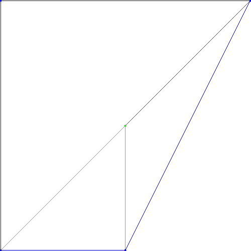
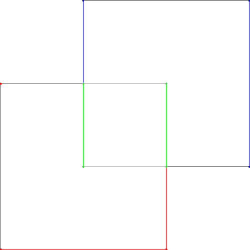

# Polygons Practice AP2 2019


1. Download the repository with the practice.

2. Enter the directory `PracticaPolygons` and compile with `make` command.

3. You must have downloaded a C++ compiler and open source library to create PNG images in C++.


## The Polygon calculator

The Polygon calculator reads commands from the standard input and writes
their answers to the standard output. In some cases, it also uses some
files.


The specification of the commands is given bellow. Each command is given in a line and produces exactly one line of output.


### Comments

Lines starting with a hash sign (`#`) are comments. Their output is just a
hash sign.

### Polygon identifiers

All commands include polygon identifiers. These are made by words, such as
`p`, `p1`, `p2`, or `pol_name`.

### Points

Points in the commands are given by two pairs of real numbers, in standard
notation, to denote the X and Y coordinates. For instance, `0 0` or `8.34
-2.3`. When printed, all real numbers are formatted with three digits
after the decimal dot.

### Colors

Colors in the commands are given by three real numbers in [0,1], in standard
notation, to denote the RGB color. For instance, `0 0 0` denotes black, `1 0
0` denotes red, and `1 0.64 0` denotes orange.

### File names

Filenames in the commands are made up of words, such as `f`, `pol.txt` or
`some_file_name.pol`.

## Commands

### `polygon`

The `polygon` command associates an identifier with a convex polygon made by a
set of zero or more points. If the polygon identifier is new, it will create
it. If it already existed, it will overwrite the previous polygon. New
polygons are black.


###  `print` 

The `print` command prints the name and the vertices of a given
polygon. The output only contains the vertices in the convex hull of the
polygon, in clockwise order, starting from the vertex will lower X (and the
vertex with lower Y in case of ties). They are printed in a single line,
with one space separating each value.


### `area` 

The `area` command prints the area of the given polygon.

### `perimeter`

The `perimeter` command prints the perimeter of the given polygon.

### `vertices` 

The `vertices` command prints the number of vertices of the convex hull of the
given polygon.


### `centroid` 

The `centroid` command prints the centroid of the given polygon.

If the given polygon has no vertices the following error is printed: the polygon has no vertices

### `list` 

The `list` command lists all polygon identifiers, lexycographically sorted.

### `save`

The `save` command saves the given polygons in a file, overwriting it if it
already existed. The contents of the file are the same as in the `print`
command, with a polygon per line.

### `load` 

The `load` command loads the polygons stored in a file, in the same way as
`polygon`, but retrieving the vertices and identifiers from the file.

If the file doesn't exist or another program is writing it the following error is printed: file not valid

### `setcol` 

The `setcol` command associates a color to the given polygon.

If the numbers that associate the colors are bigger than 1.0 or smaller than 0.0 the following error is printed: invalid color

### `draw`

The `draw` command draws a list of polygons in a PNG file, each one with its
associated color. The image is of 500x500 pixels, with white background
and the coordinates of the vertices are scaled to fit in the 498x498
central part of the image, while preserving the original aspect ratio.

If any of the polygons given have no vertices the following error is printed: the polygon has no vertices.


### `intersection` 

This command may receive two or three parameters:

- When receiving two parameters `p1` and `p2`, `p1` is updated to the intersection of the original `p1` and `p2`.

- When receiving three parameters `p1`, `p2` and `p3`, `p1` is updated to the intersection of `p2` and `p3`.
If the parameter `p1` already existed it is overwrited with the value of the intersection.


### `union` 

Just as the `intersection` command, but with the convex union of polygons.


### `inside` 

Given two polygons, the `inside` command prints `yes` or `not` to tell whether
the first is inside the second or not.


### `bbox` 

The `bbox` command creates a new polygon with the four vertices corresponding to the
bounding box of the given polygons.


### Commands without answer

Some commands do not really produce an answer. In
this case `ok` is printed, unless there is some error.


## Errors

If any command contains or produces an error, the error is printed in a
line starting with `error: ` and the command is completely ignored (as if
it was not given). Possible errors include:

- invalid command
- command with wrong number of arguments
- undefined polygon identifier
- invalid color
- file not valid

## Precision

In order to cope with precision issues of float numbers, I have used an absolute
tolerance of `1e-12` when comparing values.


# Test Game

Given that the content of `file2.txt` is

```bash
p2 1 1 0.5 0.1 0 0 1 0
p3 0.1 0.1
```

the execution of the script using the calculator on the left should produce the output on the right:

<table>
<tr>
<td>

```
# sample script for the polygon calculator
polygon p1 2 2  0 2  0 0
print p1
area p1
perimeter p1
vertices p1
centroid p1
save file1.txt p1
load file2.txt
list
print p1
print p2
print p3
union p3 p1 p2
print p3
inside p1 p3
setcol p1 1 0 0
setcol p2 0 1 0
setcol p3 0 0 1
draw image.png p1 p2 p3
bbox p4 p1 p2
print p4
polygon p5 0 0 2 2 2 0 0 2
polygon p6 1 1 3 3 3 1 1 3
intersection p7 p5 p6
setcol p5 1 0 0
setcol p6 0 0 1
setcol p7 0 1 0
draw image1.png p5 p6 p7
# some errors
foobar
print p6
```

</td>
<td>

```
#
ok
p1 0.000 0.000 0.000 2.000 2.000 2.000
2.000
6.828
3
0.667 1.333
ok
ok
p1 p2 p3
p1 0.000 0.000 0.000 2.000 2.000 2.000
p2 0.000 0.000 1.000 1.000 1.000 0.000
p3 0.100 0.100
ok
p3 0.000 0.000 0.000 2.000 2.000 2.000 1.000 0.000
yes
ok
ok
ok
ok
ok
p4 0.000 0.000 0.000 2.000 2.000 2.000 2.000 0.000
ok
ok
ok
ok
ok
ok
ok
#
error: invalid command
error: undefined polygon identifier
```

</td>
</tr>
</table>

Moreover, the content of `file1.txt` will be:

```bash
p1  0.000 0.000 0.000 2.000 2.000 2.000
```

`image.png` will be



and `image1.png` will be


